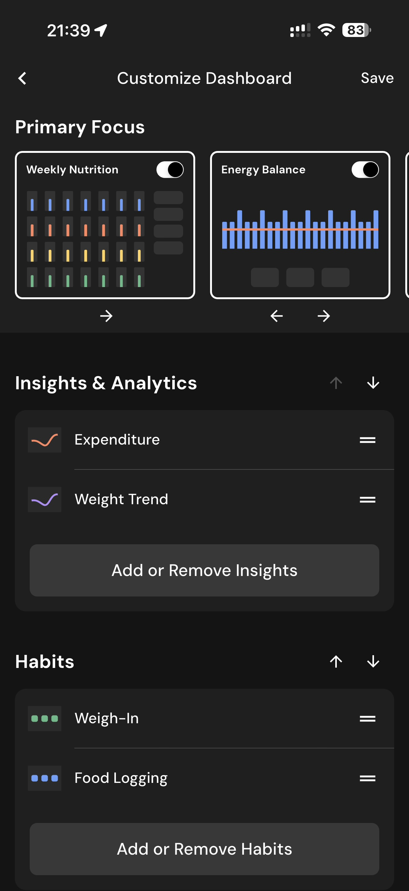

# 093 — Personalizar Dashboard

## Descrição fiel

Telas para ordenar, ativar ou remover cartões de insights, hábitos, métricas corporais, nutrientes e itens gerais. A navegação inferior mostra a aba Dashboard e o conteúdo é organizado em cartões de métricas. A página “Customize Dashboard” mostra cartões de foco principal, insights, hábitos e controles de ordenação.

## Elementos visuais e estado

- **Aplicativo:** MacroFactor.
- **Tema predominante:** interface escura, fundo preto/cinza, tipografia branca e cartões com bordas discretas.
- **Seção do fluxo:** Personalização do dashboard.
- **Estado documentado:** Personalizar Dashboard.
- **Navegação:** barra superior com retorno ou título quando aplicável; ações principais aparecem geralmente em botão largo no rodapé; nas áreas principais do app há barra de abas inferior.

## Identificação

- **Arquivo da imagem:** `093-personalizar-dashboard.JPG`
- **Posição no conjunto:** 93 de 186

## Sequência

- **Anterior:** `092-dashboard-mais-opcoes.JPG`
- **Próxima:** `094-personalizar-habitos-e-metricas.JPG`
