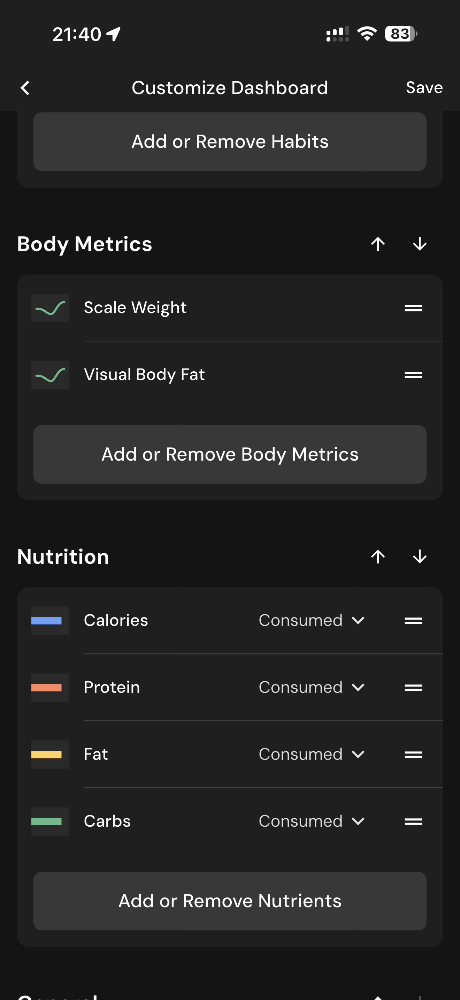

# 095 — Personalizar Nutricao

## Descrição fiel

Telas para ordenar, ativar ou remover cartões de insights, hábitos, métricas corporais, nutrientes e itens gerais. Os blocos podem ser reordenados e possuem controles para adicionar, remover ou ativar itens.

## Elementos visuais e estado

- **Aplicativo:** MacroFactor.
- **Tema predominante:** interface escura, fundo preto/cinza, tipografia branca e cartões com bordas discretas.
- **Seção do fluxo:** Personalização do dashboard.
- **Estado documentado:** Personalizar Nutricao.
- **Navegação:** barra superior com retorno ou título quando aplicável; ações principais aparecem geralmente em botão largo no rodapé; nas áreas principais do app há barra de abas inferior.

## Identificação

- **Arquivo da imagem:** `095-personalizar-nutricao.JPG`
- **Posição no conjunto:** 95 de 186

## Sequência

- **Anterior:** `094-personalizar-habitos-e-metricas.JPG`
- **Próxima:** `096-personalizar-nutricao-e-geral.JPG`
