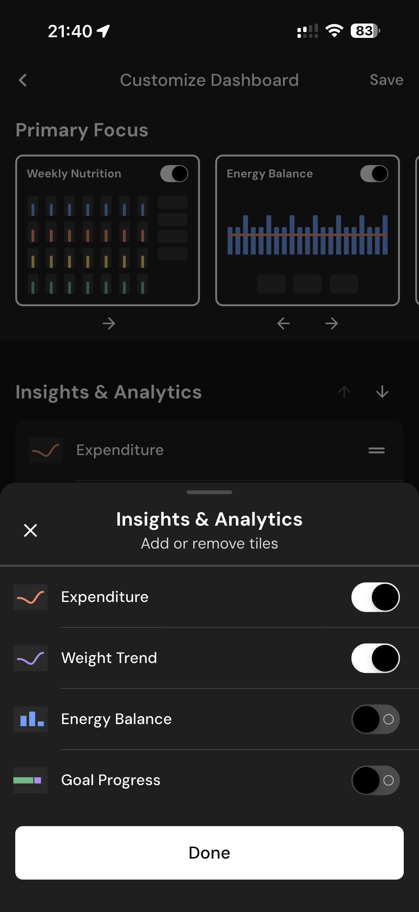

# 097 — Selecionar Insights

## Descrição fiel

Telas para ordenar, ativar ou remover cartões de insights, hábitos, métricas corporais, nutrientes e itens gerais. A captura mostra a pergunta e as alternativas ainda disponíveis para escolha.

## Elementos visuais e estado

- **Aplicativo:** MacroFactor.
- **Tema predominante:** interface escura, fundo preto/cinza, tipografia branca e cartões com bordas discretas.
- **Seção do fluxo:** Personalização do dashboard.
- **Estado documentado:** Selecionar Insights.
- **Navegação:** barra superior com retorno ou título quando aplicável; ações principais aparecem geralmente em botão largo no rodapé; nas áreas principais do app há barra de abas inferior.

## Identificação

- **Arquivo da imagem:** `097-selecionar-insights.JPG`
- **Posição no conjunto:** 97 de 186

## Sequência

- **Anterior:** `096-personalizar-nutricao-e-geral.JPG`
- **Próxima:** `098-selecionar-habitos.JPG`
