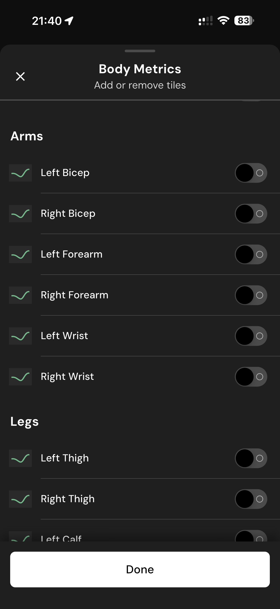

# 101 — Metricas Bracos E Pernas

## Descrição fiel

Telas para ordenar, ativar ou remover cartões de insights, hábitos, métricas corporais, nutrientes e itens gerais. A página lista medidas corporais por região, com chaves individuais de ativação.

## Elementos visuais e estado

- **Aplicativo:** MacroFactor.
- **Tema predominante:** interface escura, fundo preto/cinza, tipografia branca e cartões com bordas discretas.
- **Seção do fluxo:** Personalização do dashboard.
- **Estado documentado:** Metricas Bracos E Pernas.
- **Navegação:** barra superior com retorno ou título quando aplicável; ações principais aparecem geralmente em botão largo no rodapé; nas áreas principais do app há barra de abas inferior.

## Identificação

- **Arquivo da imagem:** `101-metricas-bracos-e-pernas.JPG`
- **Posição no conjunto:** 101 de 186

## Sequência

- **Anterior:** `100-metricas-parte-superior.JPG`
- **Próxima:** `102-metricas-pernas-e-proporcoes.JPG`
