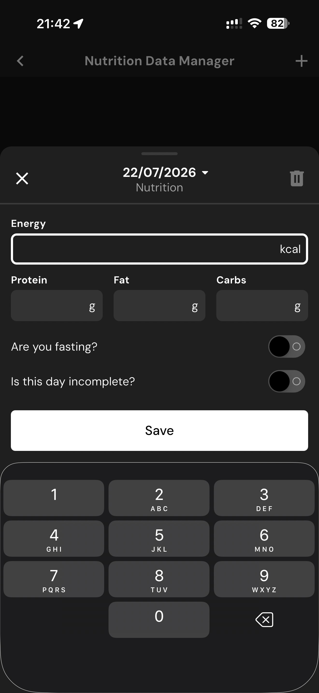

# 113 — Gerenciador Dados Nutricao

## Descrição fiel

Gerenciador nutricional, scanner, busca, câmera e recursos de IA para registrar ou descrever refeições. O conteúdo principal corresponde a “gerenciador dados nutricao”, com os dados, controles e ações associados visíveis na captura. O “Nutrition Data Manager” exibe data, campos de energia/macros, chaves de jejum/incompleto, teclado e botão Save.

## Elementos visuais e estado

- **Aplicativo:** MacroFactor.
- **Tema predominante:** interface escura, fundo preto/cinza, tipografia branca e cartões com bordas discretas.
- **Seção do fluxo:** Registro de alimentos e IA.
- **Estado documentado:** Gerenciador Dados Nutricao.
- **Navegação:** barra superior com retorno ou título quando aplicável; ações principais aparecem geralmente em botão largo no rodapé; nas áreas principais do app há barra de abas inferior.

## Identificação

- **Arquivo da imagem:** `113-gerenciador-dados-nutricao.JPG`
- **Posição no conjunto:** 113 de 186

## Sequência

- **Anterior:** `112-personalizar-geral.JPG`
- **Próxima:** `114-dashboard-carregando.JPG`
