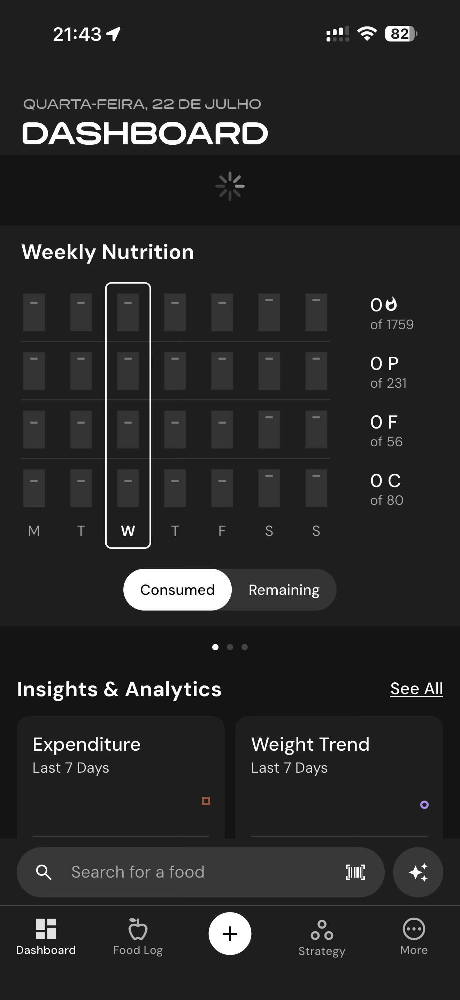

# 114 — Dashboard Carregando

## Descrição fiel

Gerenciador nutricional, scanner, busca, câmera e recursos de IA para registrar ou descrever refeições. Um indicador de carregamento aparece no centro da interface.

## Elementos visuais e estado

- **Aplicativo:** MacroFactor.
- **Tema predominante:** interface escura, fundo preto/cinza, tipografia branca e cartões com bordas discretas.
- **Seção do fluxo:** Registro de alimentos e IA.
- **Estado documentado:** Dashboard Carregando.
- **Navegação:** barra superior com retorno ou título quando aplicável; ações principais aparecem geralmente em botão largo no rodapé; nas áreas principais do app há barra de abas inferior.

## Identificação

- **Arquivo da imagem:** `114-dashboard-carregando.JPG`
- **Posição no conjunto:** 114 de 186

## Sequência

- **Anterior:** `113-gerenciador-dados-nutricao.JPG`
- **Próxima:** `115-scanner-codigo-barras.JPG`
