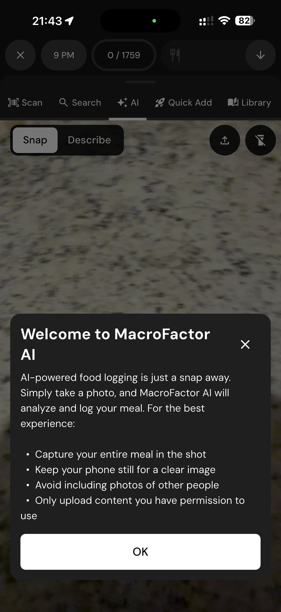

# 117 — Boas Vindas IA

## Descrição fiel

Gerenciador nutricional, scanner, busca, câmera e recursos de IA para registrar ou descrever refeições. O conteúdo principal corresponde a “boas vindas ia”, com os dados, controles e ações associados visíveis na captura. Um modal “Welcome to MacroFactor AI” explica como fotografar alimentos para análise.

## Elementos visuais e estado

- **Aplicativo:** MacroFactor.
- **Tema predominante:** interface escura, fundo preto/cinza, tipografia branca e cartões com bordas discretas.
- **Seção do fluxo:** Registro de alimentos e IA.
- **Estado documentado:** Boas Vindas IA.
- **Navegação:** barra superior com retorno ou título quando aplicável; ações principais aparecem geralmente em botão largo no rodapé; nas áreas principais do app há barra de abas inferior.

## Identificação

- **Arquivo da imagem:** `117-boas-vindas-ia.JPG`
- **Posição no conjunto:** 117 de 186

## Sequência

- **Anterior:** `116-busca-sem-historico.JPG`
- **Próxima:** `118-camera-ia.JPG`
