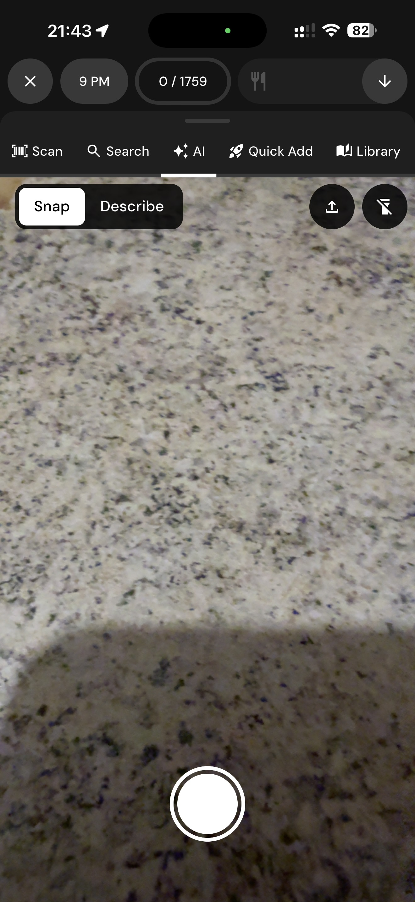

# 118 — Camera IA

## Descrição fiel

Gerenciador nutricional, scanner, busca, câmera e recursos de IA para registrar ou descrever refeições. A câmera ocupa a maior parte da tela, com enquadramento e controles para fotografar alimentos.

## Elementos visuais e estado

- **Aplicativo:** MacroFactor.
- **Tema predominante:** interface escura, fundo preto/cinza, tipografia branca e cartões com bordas discretas.
- **Seção do fluxo:** Registro de alimentos e IA.
- **Estado documentado:** Camera IA.
- **Navegação:** barra superior com retorno ou título quando aplicável; ações principais aparecem geralmente em botão largo no rodapé; nas áreas principais do app há barra de abas inferior.

## Identificação

- **Arquivo da imagem:** `118-camera-ia.JPG`
- **Posição no conjunto:** 118 de 186

## Sequência

- **Anterior:** `117-boas-vindas-ia.JPG`
- **Próxima:** `119-descrever-refeicao.JPG`
