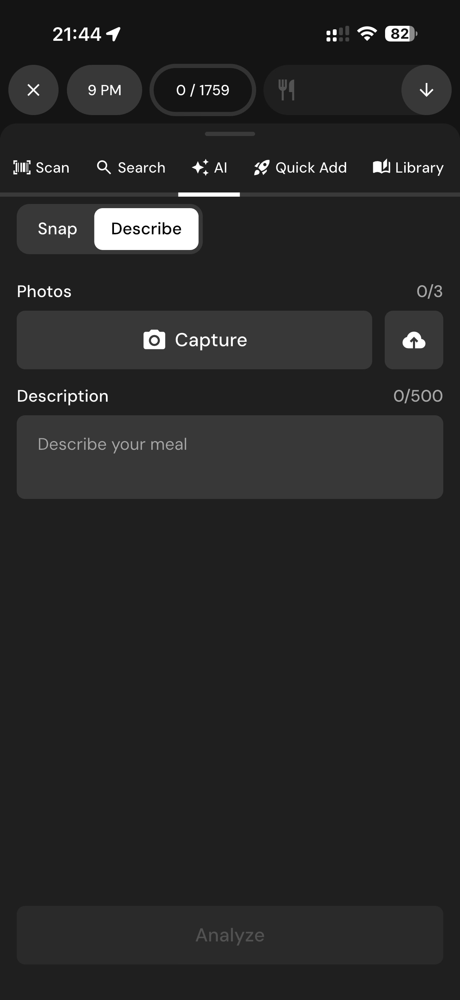

# 119 — Descrever Refeicao

## Descrição fiel

Gerenciador nutricional, scanner, busca, câmera e recursos de IA para registrar ou descrever refeições. O conteúdo principal corresponde a “descrever refeicao”, com os dados, controles e ações associados visíveis na captura.

## Elementos visuais e estado

- **Aplicativo:** MacroFactor.
- **Tema predominante:** interface escura, fundo preto/cinza, tipografia branca e cartões com bordas discretas.
- **Seção do fluxo:** Registro de alimentos e IA.
- **Estado documentado:** Descrever Refeicao.
- **Navegação:** barra superior com retorno ou título quando aplicável; ações principais aparecem geralmente em botão largo no rodapé; nas áreas principais do app há barra de abas inferior.

## Identificação

- **Arquivo da imagem:** `119-descrever-refeicao.JPG`
- **Posição no conjunto:** 119 de 186

## Sequência

- **Anterior:** `118-camera-ia.JPG`
- **Próxima:** `120-adicao-rapida.JPG`
