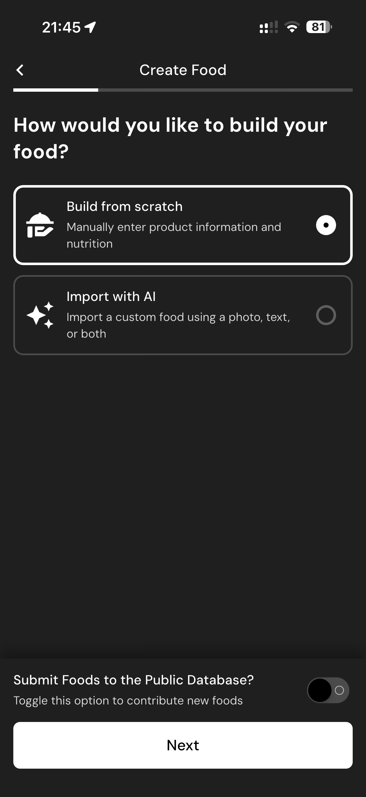

# 124 — Criar Alimento Metodo

## Descrição fiel

Assistente “Create Food”, com método de criação, fotos, identificação, porção e preenchimento detalhado de nutrientes. O conteúdo principal corresponde a “criar alimento metodo”, com os dados, controles e ações associados visíveis na captura. A pergunta “How would you like to build your food?” oferece “Build from scratch” e “Import with AI”.

## Elementos visuais e estado

- **Aplicativo:** MacroFactor.
- **Tema predominante:** interface escura, fundo preto/cinza, tipografia branca e cartões com bordas discretas.
- **Seção do fluxo:** Criação de alimento.
- **Estado documentado:** Criar Alimento Metodo.
- **Navegação:** barra superior com retorno ou título quando aplicável; ações principais aparecem geralmente em botão largo no rodapé; nas áreas principais do app há barra de abas inferior.

## Identificação

- **Arquivo da imagem:** `124-criar-alimento-metodo.JPG`
- **Posição no conjunto:** 124 de 186

## Sequência

- **Anterior:** `123-alimentos-vazios.JPG`
- **Próxima:** `125-enviar-banco-publico.JPG`
