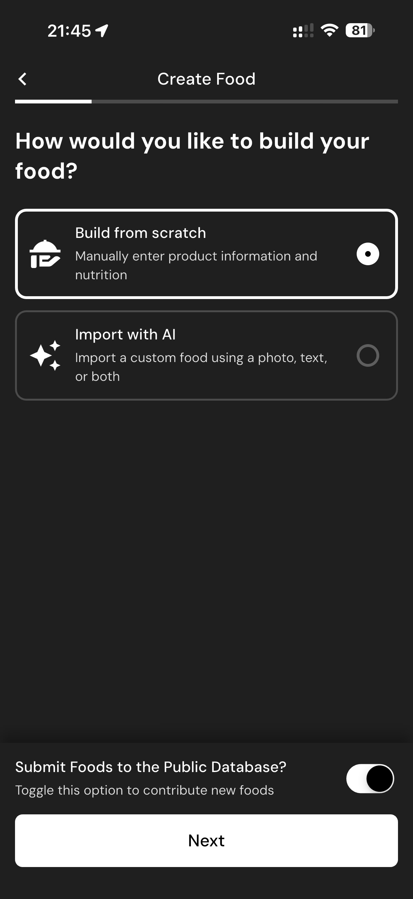

# 125 — Enviar Banco Publico

## Descrição fiel

Assistente “Create Food”, com método de criação, fotos, identificação, porção e preenchimento detalhado de nutrientes. O conteúdo principal corresponde a “enviar banco publico”, com os dados, controles e ações associados visíveis na captura.

## Elementos visuais e estado

- **Aplicativo:** MacroFactor.
- **Tema predominante:** interface escura, fundo preto/cinza, tipografia branca e cartões com bordas discretas.
- **Seção do fluxo:** Criação de alimento.
- **Estado documentado:** Enviar Banco Publico.
- **Navegação:** barra superior com retorno ou título quando aplicável; ações principais aparecem geralmente em botão largo no rodapé; nas áreas principais do app há barra de abas inferior.

## Identificação

- **Arquivo da imagem:** `125-enviar-banco-publico.JPG`
- **Posição no conjunto:** 125 de 186

## Sequência

- **Anterior:** `124-criar-alimento-metodo.JPG`
- **Próxima:** `126-fotos-embalagem.JPG`
