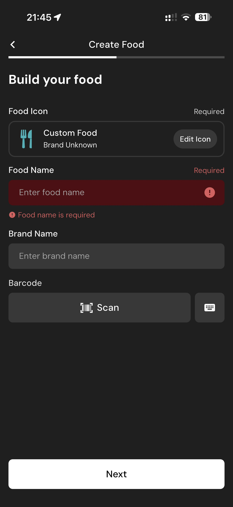

# 128 — Erro Nome Obrigatorio

## Descrição fiel

Assistente “Create Food”, com método de criação, fotos, identificação, porção e preenchimento detalhado de nutrientes. Há validação em vermelho indicando um campo obrigatório não preenchido.

## Elementos visuais e estado

- **Aplicativo:** MacroFactor.
- **Tema predominante:** interface escura, fundo preto/cinza, tipografia branca e cartões com bordas discretas.
- **Seção do fluxo:** Criação de alimento.
- **Estado documentado:** Erro Nome Obrigatorio.
- **Navegação:** barra superior com retorno ou título quando aplicável; ações principais aparecem geralmente em botão largo no rodapé; nas áreas principais do app há barra de abas inferior.

## Identificação

- **Arquivo da imagem:** `128-erro-nome-obrigatorio.JPG`
- **Posição no conjunto:** 128 de 186

## Sequência

- **Anterior:** `127-dados-alimento.JPG`
- **Próxima:** `129-dados-alimento-preenchidos.JPG`
