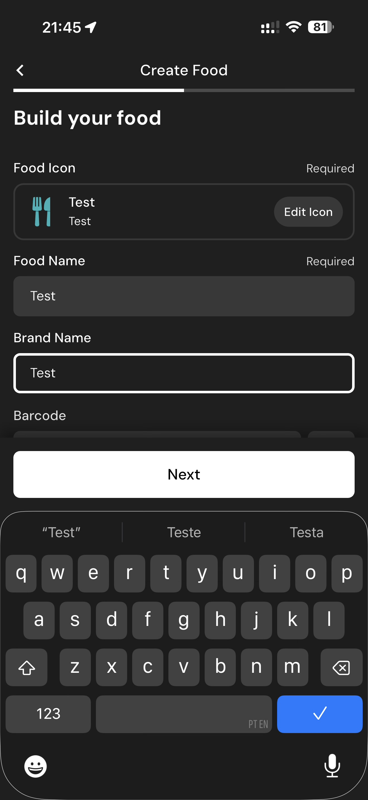

# 129 — Dados Alimento Preenchidos

## Descrição fiel

Assistente “Create Food”, com método de criação, fotos, identificação, porção e preenchimento detalhado de nutrientes. O conteúdo principal corresponde a “dados alimento preenchidos”, com os dados, controles e ações associados visíveis na captura.

## Elementos visuais e estado

- **Aplicativo:** MacroFactor.
- **Tema predominante:** interface escura, fundo preto/cinza, tipografia branca e cartões com bordas discretas.
- **Seção do fluxo:** Criação de alimento.
- **Estado documentado:** Dados Alimento Preenchidos.
- **Navegação:** barra superior com retorno ou título quando aplicável; ações principais aparecem geralmente em botão largo no rodapé; nas áreas principais do app há barra de abas inferior.

## Identificação

- **Arquivo da imagem:** `129-dados-alimento-preenchidos.JPG`
- **Posição no conjunto:** 129 de 186

## Sequência

- **Anterior:** `128-erro-nome-obrigatorio.JPG`
- **Próxima:** `130-porcao-do-alimento.JPG`
