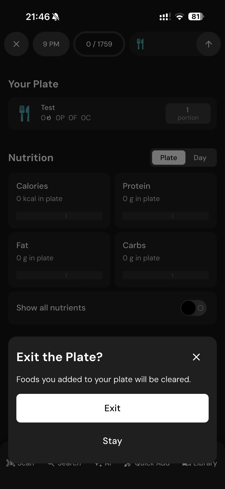

# 137 — Prato Do Dia

## Descrição fiel

Prato, linha do tempo diária, alimento registrado e painel de atalhos do diário. O conteúdo principal corresponde a “prato do dia”, com os dados, controles e ações associados visíveis na captura. “Your Plate” mostra o alimento criado e um resumo de calorias e macros.

## Elementos visuais e estado

- **Aplicativo:** MacroFactor.
- **Tema predominante:** interface escura, fundo preto/cinza, tipografia branca e cartões com bordas discretas.
- **Seção do fluxo:** Diário alimentar.
- **Estado documentado:** Prato Do Dia.
- **Navegação:** barra superior com retorno ou título quando aplicável; ações principais aparecem geralmente em botão largo no rodapé; nas áreas principais do app há barra de abas inferior.

## Identificação

- **Arquivo da imagem:** `137-prato-do-dia.JPG`
- **Posição no conjunto:** 137 de 186

## Sequência

- **Anterior:** `136-alimento-criado.JPG`
- **Próxima:** `138-sair-do-prato.JPG`
