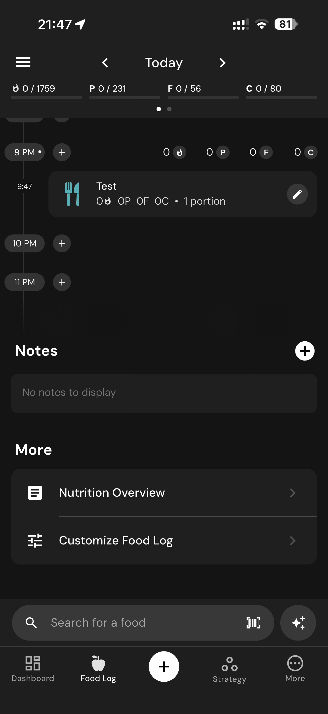

# 139 — Linha Do Tempo Vazia

## Descrição fiel

Prato, linha do tempo diária, alimento registrado e painel de atalhos do diário. O conteúdo principal corresponde a “linha do tempo vazia”, com os dados, controles e ações associados visíveis na captura. A linha do tempo diária aparece vazia, com horários, calendário superior, busca e botão de adição.

## Elementos visuais e estado

- **Aplicativo:** MacroFactor.
- **Tema predominante:** interface escura, fundo preto/cinza, tipografia branca e cartões com bordas discretas.
- **Seção do fluxo:** Diário alimentar.
- **Estado documentado:** Linha Do Tempo Vazia.
- **Navegação:** barra superior com retorno ou título quando aplicável; ações principais aparecem geralmente em botão largo no rodapé; nas áreas principais do app há barra de abas inferior.

## Identificação

- **Arquivo da imagem:** `139-linha-do-tempo-vazia.JPG`
- **Posição no conjunto:** 139 de 186

## Sequência

- **Anterior:** `138-sair-do-prato.JPG`
- **Próxima:** `140-linha-do-tempo-com-alimento.JPG`
