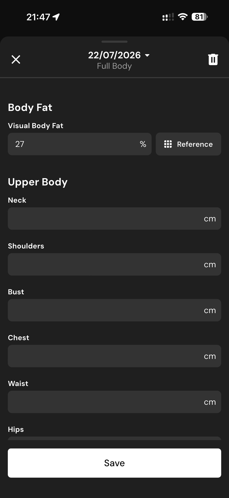

# 141 — Atalhos Registro

## Descrição fiel

Prato, linha do tempo diária, alimento registrado e painel de atalhos do diário. O conteúdo principal corresponde a “atalhos registro”, com os dados, controles e ações associados visíveis na captura.

## Elementos visuais e estado

- **Aplicativo:** MacroFactor.
- **Tema predominante:** interface escura, fundo preto/cinza, tipografia branca e cartões com bordas discretas.
- **Seção do fluxo:** Diário alimentar.
- **Estado documentado:** Atalhos Registro.
- **Navegação:** barra superior com retorno ou título quando aplicável; ações principais aparecem geralmente em botão largo no rodapé; nas áreas principais do app há barra de abas inferior.

## Identificação

- **Arquivo da imagem:** `141-atalhos-registro.JPG`
- **Posição no conjunto:** 141 de 186

## Sequência

- **Anterior:** `140-linha-do-tempo-com-alimento.JPG`
- **Próxima:** `142-editar-gordura-corporal.JPG`
