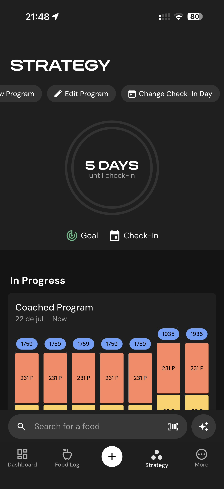

# 143 — Estrategia Programa

## Descrição fiel

Edição de gordura corporal e telas “Strategy” com programa em andamento, meta e histórico. A tela apresenta dados do programa calculado ou controles para configurá-lo. A tela “STRATEGY” mostra círculo de dias até o check-in e o programa semanal colorido em andamento.

## Elementos visuais e estado

- **Aplicativo:** MacroFactor.
- **Tema predominante:** interface escura, fundo preto/cinza, tipografia branca e cartões com bordas discretas.
- **Seção do fluxo:** Estratégia e meta.
- **Estado documentado:** Estrategia Programa.
- **Navegação:** barra superior com retorno ou título quando aplicável; ações principais aparecem geralmente em botão largo no rodapé; nas áreas principais do app há barra de abas inferior.

## Identificação

- **Arquivo da imagem:** `143-estrategia-programa.JPG`
- **Posição no conjunto:** 143 de 186

## Sequência

- **Anterior:** `142-editar-gordura-corporal.JPG`
- **Próxima:** `144-estrategia-acoes.JPG`
