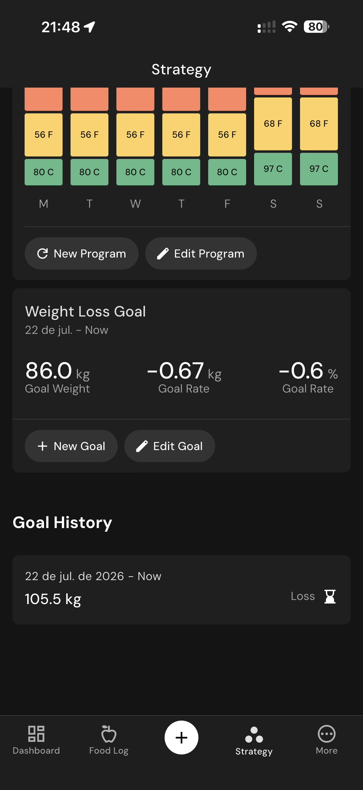

# 145 — Estrategia Em Andamento

## Descrição fiel

Edição de gordura corporal e telas “Strategy” com programa em andamento, meta e histórico. O conteúdo principal corresponde a “estrategia em andamento”, com os dados, controles e ações associados visíveis na captura.

## Elementos visuais e estado

- **Aplicativo:** MacroFactor.
- **Tema predominante:** interface escura, fundo preto/cinza, tipografia branca e cartões com bordas discretas.
- **Seção do fluxo:** Estratégia e meta.
- **Estado documentado:** Estrategia Em Andamento.
- **Navegação:** barra superior com retorno ou título quando aplicável; ações principais aparecem geralmente em botão largo no rodapé; nas áreas principais do app há barra de abas inferior.

## Identificação

- **Arquivo da imagem:** `145-estrategia-em-andamento.JPG`
- **Posição no conjunto:** 145 de 186

## Sequência

- **Anterior:** `144-estrategia-acoes.JPG`
- **Próxima:** `146-historico-da-meta.JPG`
