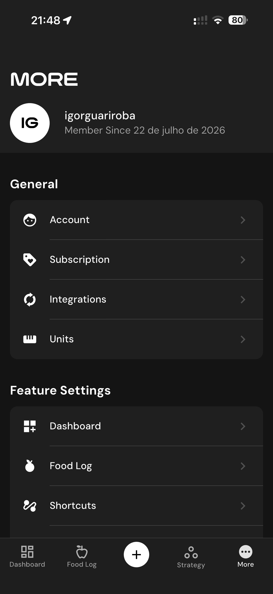

# 146 — Historico Da Meta

## Descrição fiel

Edição de gordura corporal e telas “Strategy” com programa em andamento, meta e histórico. A tela apresenta parâmetros da meta de peso, ritmo ou histórico de progresso. Há resumo da meta de perda de peso, taxa e histórico desde 105,5 kg.

## Elementos visuais e estado

- **Aplicativo:** MacroFactor.
- **Tema predominante:** interface escura, fundo preto/cinza, tipografia branca e cartões com bordas discretas.
- **Seção do fluxo:** Estratégia e meta.
- **Estado documentado:** Historico Da Meta.
- **Navegação:** barra superior com retorno ou título quando aplicável; ações principais aparecem geralmente em botão largo no rodapé; nas áreas principais do app há barra de abas inferior.

## Identificação

- **Arquivo da imagem:** `146-historico-da-meta.JPG`
- **Posição no conjunto:** 146 de 186

## Sequência

- **Anterior:** `145-estrategia-em-andamento.JPG`
- **Próxima:** `147-mais-configuracoes.JPG`
