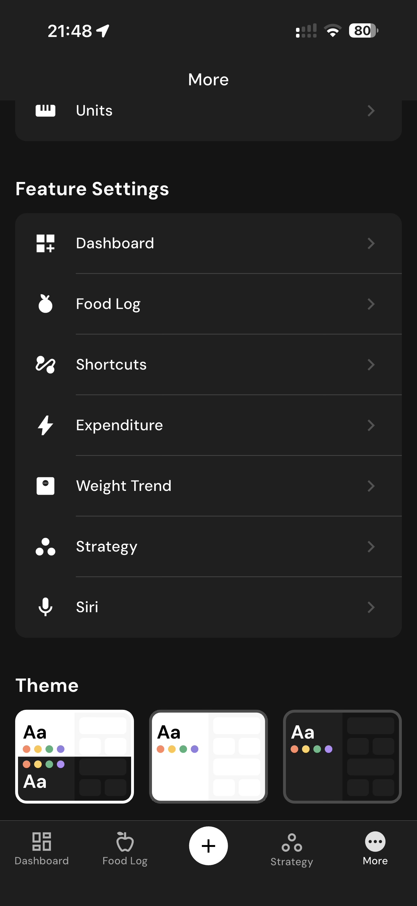

# 147 — Mais Configuracoes

## Descrição fiel

Área “More” e páginas de conta, assinatura, integrações, unidades, diário, atalhos, algoritmos, Siri, dados, suporte e informações legais. A interface apresenta opções agrupadas em cartões/linhas navegáveis e controles de estado. A área “MORE” mostra perfil e grupos General e Feature Settings, com navegação inferior.

## Elementos visuais e estado

- **Aplicativo:** MacroFactor.
- **Tema predominante:** interface escura, fundo preto/cinza, tipografia branca e cartões com bordas discretas.
- **Seção do fluxo:** Configurações.
- **Estado documentado:** Mais Configuracoes.
- **Navegação:** barra superior com retorno ou título quando aplicável; ações principais aparecem geralmente em botão largo no rodapé; nas áreas principais do app há barra de abas inferior.

## Identificação

- **Arquivo da imagem:** `147-mais-configuracoes.JPG`
- **Posição no conjunto:** 147 de 186

## Sequência

- **Anterior:** `146-historico-da-meta.JPG`
- **Próxima:** `148-configuracoes-recursos.JPG`
