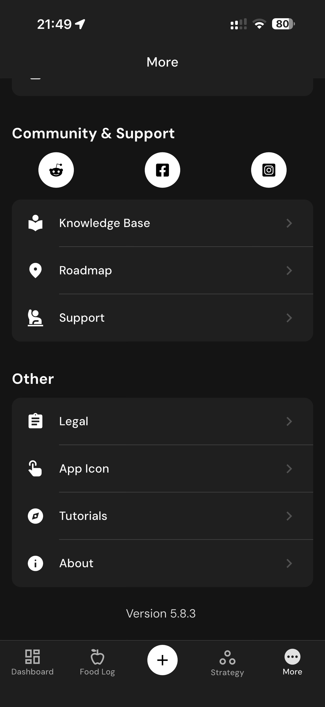

# 150 — Comunidade E Suporte

## Descrição fiel

Área “More” e páginas de conta, assinatura, integrações, unidades, diário, atalhos, algoritmos, Siri, dados, suporte e informações legais. A tela reúne canais de contato, conversas, solicitação de recurso, relato de problema e diagnóstico.

## Elementos visuais e estado

- **Aplicativo:** MacroFactor.
- **Tema predominante:** interface escura, fundo preto/cinza, tipografia branca e cartões com bordas discretas.
- **Seção do fluxo:** Configurações.
- **Estado documentado:** Comunidade E Suporte.
- **Navegação:** barra superior com retorno ou título quando aplicável; ações principais aparecem geralmente em botão largo no rodapé; nas áreas principais do app há barra de abas inferior.

## Identificação

- **Arquivo da imagem:** `150-comunidade-e-suporte.JPG`
- **Posição no conjunto:** 150 de 186

## Sequência

- **Anterior:** `149-tema-e-dados.JPG`
- **Próxima:** `151-sobre-e-versao.JPG`
