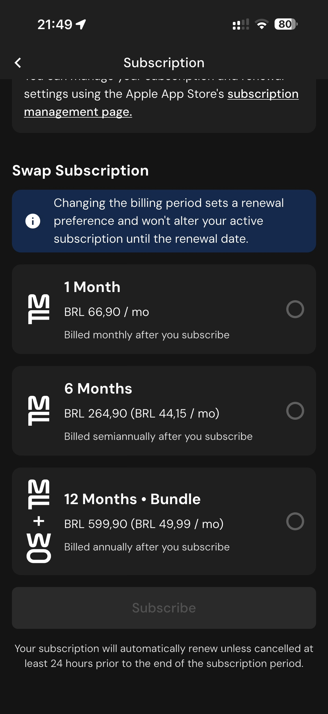

# 154 — Assinatura Ativa

## Descrição fiel

Área “More” e páginas de conta, assinatura, integrações, unidades, diário, atalhos, algoritmos, Siri, dados, suporte e informações legais. A página exibe período/plano, preço e opções de gerenciamento ou troca.

## Elementos visuais e estado

- **Aplicativo:** MacroFactor.
- **Tema predominante:** interface escura, fundo preto/cinza, tipografia branca e cartões com bordas discretas.
- **Seção do fluxo:** Configurações.
- **Estado documentado:** Assinatura Ativa.
- **Navegação:** barra superior com retorno ou título quando aplicável; ações principais aparecem geralmente em botão largo no rodapé; nas áreas principais do app há barra de abas inferior.

## Identificação

- **Arquivo da imagem:** `154-assinatura-ativa.JPG`
- **Posição no conjunto:** 154 de 186

## Sequência

- **Anterior:** `153-perfil-e-seguranca.JPG`
- **Próxima:** `155-trocar-assinatura.JPG`
