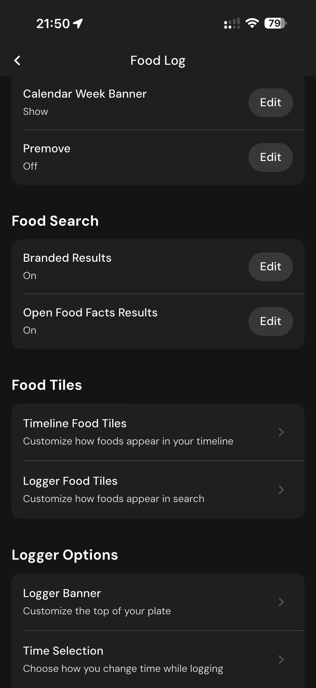

# 160 — Opcoes Linha Do Tempo

## Descrição fiel

Área “More” e páginas de conta, assinatura, integrações, unidades, diário, atalhos, algoritmos, Siri, dados, suporte e informações legais. O conteúdo principal corresponde a “opcoes linha do tempo”, com os dados, controles e ações associados visíveis na captura.

## Elementos visuais e estado

- **Aplicativo:** MacroFactor.
- **Tema predominante:** interface escura, fundo preto/cinza, tipografia branca e cartões com bordas discretas.
- **Seção do fluxo:** Configurações.
- **Estado documentado:** Opcoes Linha Do Tempo.
- **Navegação:** barra superior com retorno ou título quando aplicável; ações principais aparecem geralmente em botão largo no rodapé; nas áreas principais do app há barra de abas inferior.

## Identificação

- **Arquivo da imagem:** `160-opcoes-linha-do-tempo.JPG`
- **Posição no conjunto:** 160 de 186

## Sequência

- **Anterior:** `159-configuracoes-diario.JPG`
- **Próxima:** `161-busca-e-blocos-alimentos.JPG`
