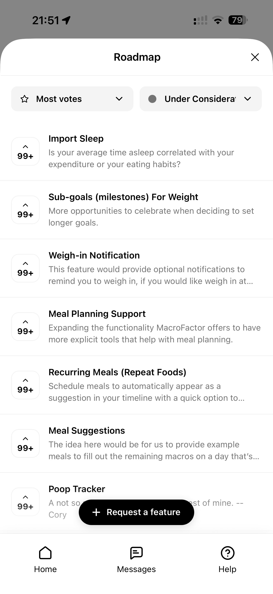

# 174 — Roadmap Solicitacoes

## Descrição fiel

Área “More” e páginas de conta, assinatura, integrações, unidades, diário, atalhos, algoritmos, Siri, dados, suporte e informações legais. Uma página clara incorporada lista solicitações e permite pedir um novo recurso.

## Elementos visuais e estado

- **Aplicativo:** MacroFactor.
- **Tema predominante:** interface escura, fundo preto/cinza, tipografia branca e cartões com bordas discretas.
- **Seção do fluxo:** Configurações.
- **Estado documentado:** Roadmap Solicitacoes.
- **Navegação:** barra superior com retorno ou título quando aplicável; ações principais aparecem geralmente em botão largo no rodapé; nas áreas principais do app há barra de abas inferior.

## Identificação

- **Arquivo da imagem:** `174-roadmap-solicitacoes.JPG`
- **Posição no conjunto:** 174 de 186

## Sequência

- **Anterior:** `173-roadmap.JPG`
- **Próxima:** `175-suporte.JPG`
