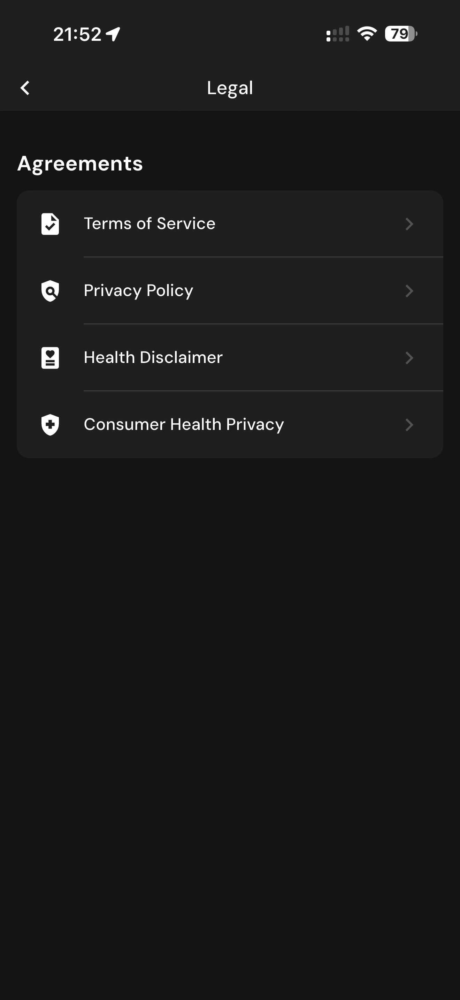

# 177 — Documentos Legais

## Descrição fiel

Área “More” e páginas de conta, assinatura, integrações, unidades, diário, atalhos, algoritmos, Siri, dados, suporte e informações legais. O conteúdo principal corresponde a “documentos legais”, com os dados, controles e ações associados visíveis na captura. A tela Legal lista Terms of Service, Privacy Policy, Health Disclaimer e Consumer Health Privacy.

## Elementos visuais e estado

- **Aplicativo:** MacroFactor.
- **Tema predominante:** interface escura, fundo preto/cinza, tipografia branca e cartões com bordas discretas.
- **Seção do fluxo:** Configurações.
- **Estado documentado:** Documentos Legais.
- **Navegação:** barra superior com retorno ou título quando aplicável; ações principais aparecem geralmente em botão largo no rodapé; nas áreas principais do app há barra de abas inferior.

## Identificação

- **Arquivo da imagem:** `177-documentos-legais.JPG`
- **Posição no conjunto:** 177 de 186

## Sequência

- **Anterior:** `176-suporte-modo-escuro.JPG`
- **Próxima:** `178-icone-do-app.JPG`
