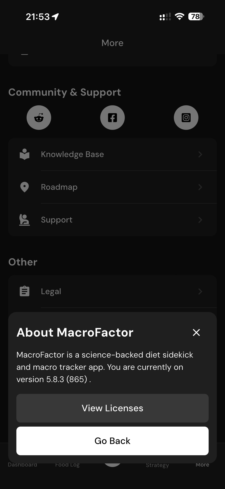

# 180 — Sobre MacroFactor

## Descrição fiel

Área “More” e páginas de conta, assinatura, integrações, unidades, diário, atalhos, algoritmos, Siri, dados, suporte e informações legais. O conteúdo principal corresponde a “sobre macrofactor”, com os dados, controles e ações associados visíveis na captura. Um modal “About MacroFactor” informa que o app é baseado em ciência, mostra a versão e botões de licenças/retorno.

## Elementos visuais e estado

- **Aplicativo:** MacroFactor.
- **Tema predominante:** interface escura, fundo preto/cinza, tipografia branca e cartões com bordas discretas.
- **Seção do fluxo:** Configurações.
- **Estado documentado:** Sobre MacroFactor.
- **Navegação:** barra superior com retorno ou título quando aplicável; ações principais aparecem geralmente em botão largo no rodapé; nas áreas principais do app há barra de abas inferior.

## Identificação

- **Arquivo da imagem:** `180-sobre-macrofactor.JPG`
- **Posição no conjunto:** 180 de 186

## Sequência

- **Anterior:** `179-redefinir-tutoriais.JPG`
- **Próxima:** `181-licencas-inicio.JPG`
