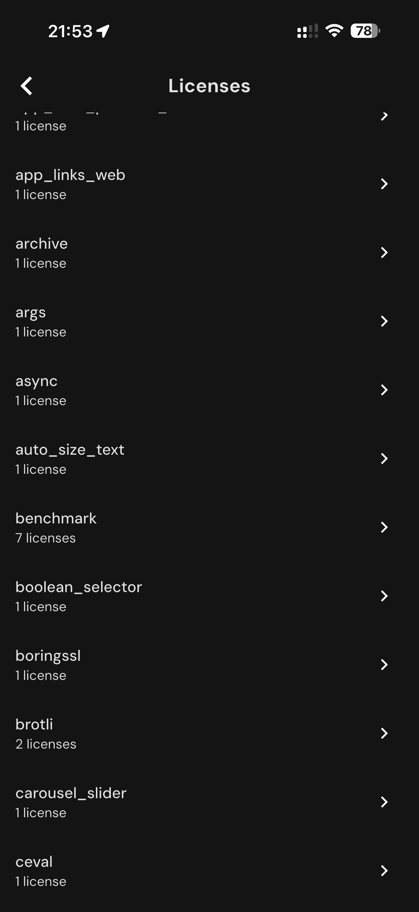

# 182 — Licencas Lista A

## Descrição fiel

Listas de licenças de software e captura final do dashboard semanal. A tela lista componentes de software de terceiros e a quantidade de licenças associada a cada item.

## Elementos visuais e estado

- **Aplicativo:** MacroFactor.
- **Tema predominante:** interface escura, fundo preto/cinza, tipografia branca e cartões com bordas discretas.
- **Seção do fluxo:** Licenças e encerramento.
- **Estado documentado:** Licencas Lista A.
- **Navegação:** barra superior com retorno ou título quando aplicável; ações principais aparecem geralmente em botão largo no rodapé; nas áreas principais do app há barra de abas inferior.

## Identificação

- **Arquivo da imagem:** `182-licencas-lista-a.JPG`
- **Posição no conjunto:** 182 de 186

## Sequência

- **Anterior:** `181-licencas-inicio.JPG`
- **Próxima:** `183-licencas-lista-d.JPG`
