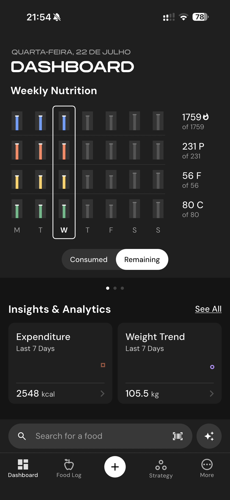

# 186 — Dashboard Final

## Descrição fiel

Listas de licenças de software e captura final do dashboard semanal. A navegação inferior mostra a aba Dashboard e o conteúdo é organizado em cartões de métricas. Captura final do Dashboard com Weekly Nutrition na opção Remaining e cartões Expenditure e Weight Trend.

## Elementos visuais e estado

- **Aplicativo:** MacroFactor.
- **Tema predominante:** interface escura, fundo preto/cinza, tipografia branca e cartões com bordas discretas.
- **Seção do fluxo:** Licenças e encerramento.
- **Estado documentado:** Dashboard Final.
- **Navegação:** barra superior com retorno ou título quando aplicável; ações principais aparecem geralmente em botão largo no rodapé; nas áreas principais do app há barra de abas inferior.

## Identificação

- **Arquivo da imagem:** `186-dashboard-final.JPG`
- **Posição no conjunto:** 186 de 186

## Sequência

- **Anterior:** `185-licencas-lista-w.JPG`
